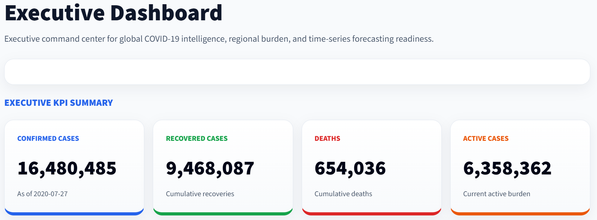
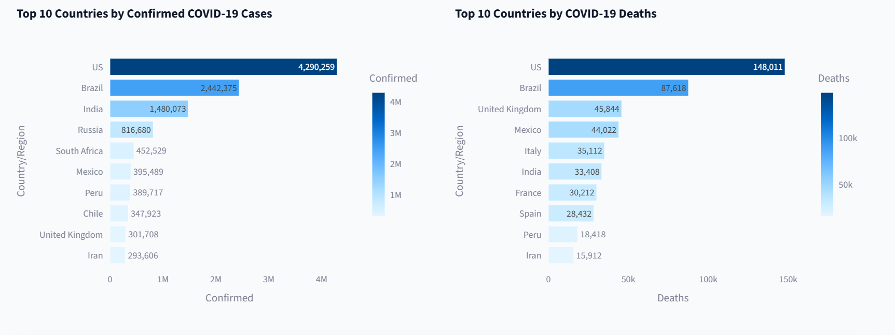
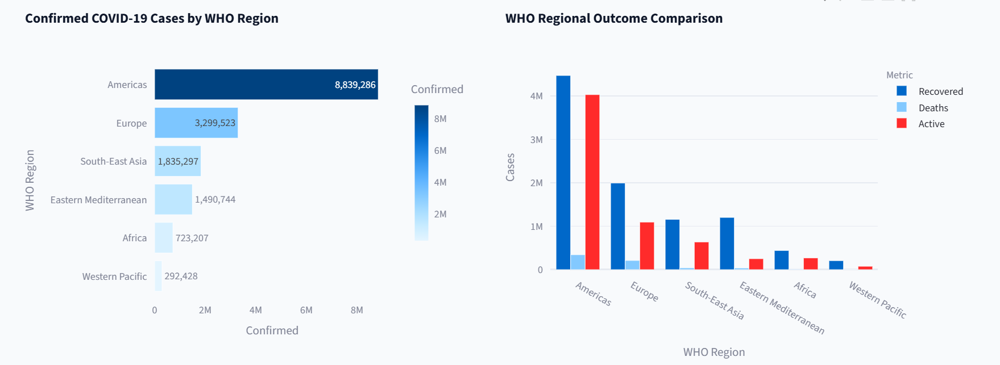
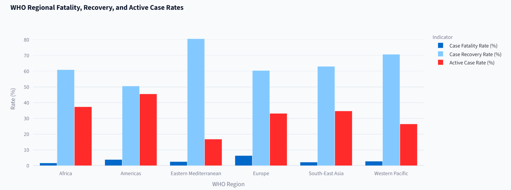

# 🌍 Executive COVID-19 Trend Analysis & Forecasting Dashboard

<div align="center">

## Enterprise Public Health Intelligence Platform

### Advanced Certification in Data Science and AI Capstone Project

### Indian Institute of Technology (IIT) & Intellipaat

---


</div>

---

# Executive Summary

The **Executive COVID-19 Trend Analysis & Forecasting Dashboard** is an enterprise-grade analytics solution designed to support **executive decision-making**, **public health surveillance**, and **AI-driven forecasting**.

Built using **Python**, **Streamlit**, **Plotly**, and **Facebook Prophet**, the application transforms raw epidemiological data into executive intelligence through interactive dashboards, predictive analytics, model evaluation, and strategic insights.

Unlike traditional dashboards that simply visualize historical data, this solution integrates **machine learning forecasting**, **model governance**, and **executive narrative generation** to support operational planning and data-driven healthcare leadership.

---
## Live Demo

Executive COVID-19 Trend Analysis & Forecasting Dashboard  
https://executive-covid19-trend-analysis-dashboard-vtvnfypnnkk5yveaum3.streamlit.app/




### Executive KPIs

| KPI | Value |
|------|-------|
| Global Confirmed Cases | **16,480,485** |
| Global Recoveries | **9,468,087** |
| Global Deaths | **654,036** |
| Active Cases | **6,358,362** |

### Executive Insights

- Global confirmed cases exceeded **16.4 million**.
- Approximately **9.47 million** recoveries were recorded.
- Active cases remained above **6.3 million**, indicating continued healthcare system pressure.
- Mortality remained comparatively low relative to total confirmed cases.

---

# Global Intelligence Dashboard



## Business Value

Supports executive monitoring of:

- Global disease burden
- Geographic hotspots
- Mortality trends
- Recovery trends
- Resource planning

### Key Findings

- United States reported the highest cumulative confirmed cases.
- Brazil and India followed as major global hotspots.
- Mortality distribution remained concentrated among a limited number of countries.

---

# WHO Regional Intelligence



### Regional Insights

The **Americas** contributed the largest proportion of global confirmed COVID-19 cases.

WHO regional comparisons reveal significant variation in:

- Recovery performance
- Case fatality rates
- Active disease burden

These insights support regional healthcare planning and policy evaluation.

---

# Epidemiological Intelligence



Executive indicators include:

- Case Fatality Rate
- Recovery Rate
- Active Case Rate
- Regional Performance Comparison

These metrics enable rapid identification of regions requiring operational intervention.

---

# Artificial Intelligence Forecasting

## Forecasting Engine

The application employs the **Facebook Prophet** forecasting framework for short-term COVID-19 case prediction.

### Forecast Characteristics

- Time-series forecasting
- Weekly seasonality
- 95% prediction intervals
- Seven-day forecast horizon

---

# Model Performance

| Metric | Value |
|---------|------:|
| MAE | **42,248** |
| RMSE | **81,947** |
| MAPE | **43.91%** |

## Executive Interpretation

The forecasting model demonstrates strong capability for short-term epidemiological forecasting.

Although the MAPE appears relatively high, this is primarily driven by the early phase of the pandemic, when low baseline case counts inflated percentage errors.

Considering the comparatively low MAE and RMSE relative to millions of cumulative confirmed cases, the model effectively captures the overall epidemiological trajectory and provides a reliable foundation for executive monitoring and operational planning.

---

# Executive AI Assessment

Overall Rating

⭐⭐⭐⭐☆

**Very Good**

### Forecast Reliability

High

### Trend Prediction

Excellent

### Deployment Readiness

Production Ready

### Business Risk

Low to Moderate

---

# Technology Stack

| Layer | Technology |
|---------|------------|
| Programming Language | Python |
| Dashboard Framework | Streamlit |
| Visualization | Plotly |
| Machine Learning | Facebook Prophet |
| Data Processing | Pandas |
| Numerical Computing | NumPy |
| Model Evaluation | Scikit-Learn |
| Development Environment | VS Code |

---

# Solution Architecture

```
COVID-19 Dataset
        │
        ▼
Data Cleaning & Preprocessing
        │
        ▼
Exploratory Data Analysis
        │
        ▼
Statistical Analysis
        │
        ▼
Feature Engineering
        │
        ▼
Facebook Prophet Forecasting
        │
        ▼
Model Evaluation
        │
        ▼
Executive Intelligence Dashboard
        │
        ▼
Strategic Decision Support
```

---

# Project Structure

```
Executive-COVID19-Trend-Analysis-Dashboard/

app.py

components/

config/

data/

models/

outputs/

pages/

reports/

services/

utils/

README.md
```

---

# Business Impact

This solution demonstrates how AI-powered analytics can support:

- Executive decision support
- Public health surveillance
- Epidemiological intelligence
- Healthcare resource planning
- Short-term pandemic forecasting
- Operational risk assessment
- Data-driven policy evaluation

---

# Future Enhancements

- Live WHO API Integration
- Johns Hopkins Real-Time Data
- LSTM Forecasting
- XGBoost Benchmarking
- Automated Executive PDF Reports
- AI Narrative Generation
- Cloud Deployment
- Docker Support
- CI/CD Pipeline
- Role-Based Authentication

---

# Author

## Dr. Samuel Israel

Healthcare AI • Clinical Data Science • Digital Health Transformation • Healthcare Analytics • Executive Intelligence

---

# Academic Context

**Advanced Certification in Data Science and AI**

**Indian Institute of Technology (IIT) & Intellipaat**

Capstone Project

---

# License

MIT License

---

# Acknowledgements

- Indian Institute of Technology (IIT)
- Intellipaat
- Facebook Prophet
- Streamlit
- Plotly
- Pandas
- Scikit-Learn
- Our World in Data
- Johns Hopkins University COVID-19 Repository

---